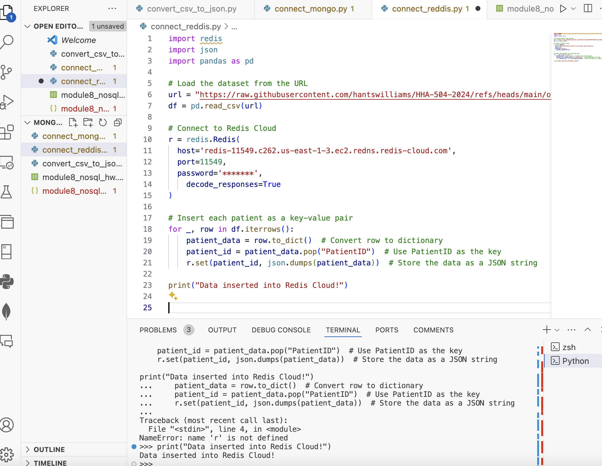

# HHA504_assignment_nosql_dbs

## Deliverables
  - Screenshots of database creation and configuration for BigQuery, MongoDB Atlas, and Redis Cloud.
  - BigQuery dataset creation and query results.
  - Reflections on working with each of the three platforms.

#  Database Setup
## BigQuery:

## MongoDB:

## Redis:

# Query Results
## BigQuery:

## MongoDB:

## Redis:

# Reflections
 - Personally, I found Redis to be the easiest platform for executing changes due to its straightforward key-value store model and user-friendly tools like Redis Insight. However, when it came to uploading files, BigQuery stood out as the simplest and most intuitive option, with its seamless interface for handling large datasets. 
 Setting up MongoDB initially posed some challenges, but after multiple attempts and using MongoDB Compass, the process became much clearer. Once configured, I found MongoDB's flexibility and JSON-like structure to be powerful and relatively easy to work with.
